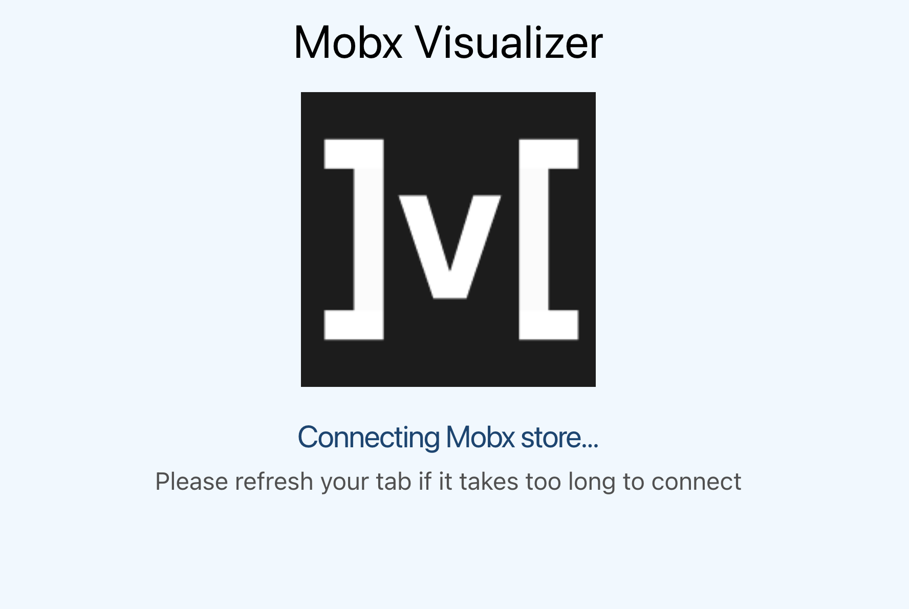
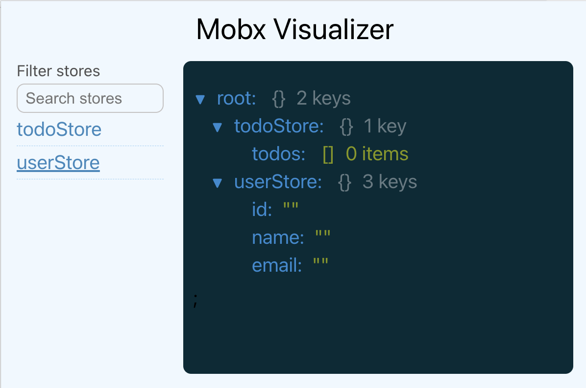

<p align="center">
  
</p>

## Mobx Visualizer ⚙️ 🚀
Mobx Visualizer is a tool packaged as a browser extension to visualize the Mobx state tree. It makes it easy to see the current state of your application and how it changes over time.
> What is Mobx? <br/> https://mobx.js.org/README.html

### Getting started
1. Install the extension from the [Chrome Web Store](https://chrome.google.com/webstore/detail/mobx-visualizer/mbmgdekhojdlelmbmfdakoepdmaiegbl).
> Currently supported browsers: Chrome

2. Add the Mobx Visualizer to your application by adding your Mobx store to a global window object. 
```javascript
    window.__MOBX_VISUALIZER__ = stores;
```

3. Refresh the browser tab where your application is open.

4. Open the Mobx Visualizer by clicking on the extension icon in the browser toolbar.

5. Wait for the Mobx Visualizer to connect to your application.



6. Voila! You can now see the current state of your application and how it changes over time.




### Features
- Visualize the current state of your application for easier debugging and understanding.
- Focus on a single store or view the entire state tree.
- Search store by name from list of all stores.
- Updates in states happen in real-time (you'd need to pass the store object without any modification to the visualizer window object).

### Feedback
If you have any feedback, please feel free to open a Github issue anytime.